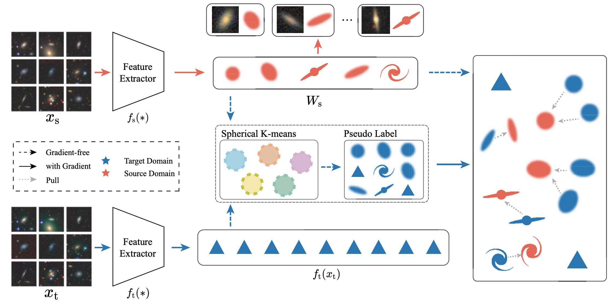

In this study, we explore 

##### Abstract

The Dark Energy Spectroscopic Instrument Legacy Imaging Surveys (DESI-LIS) comprise three distinct surveys: the Dark Energy Camera Legacy Survey (DECaLS), the Beijing–Arizona Sky Survey (BASS), and the Mayall z-band Legacy Survey (MzLS). The citizen science project Galaxy Zoo DECaLS 5 (GZD-5) has provided extensive and detailed morphology labels for a sample of 253 287 galaxies within the DECaLS survey. This data set has been foundational for numerous deep learning-based galaxy morphology classification studies. However, due to differences in signal-to-noise ratios and resolutions between the DECaLS images and those from BASS and MzLS (collectively referred to as BMz), a neural network trained on DECaLS images cannot be directly applied to BMz images due to distributional mismatch. In this study, we explore an unsupervised domain adaptation (UDA) method that fine-tunes a source domain model trained on DECaLS images with GZD-5 labels to BMz images, aiming to reduce bias in galaxy morphology classification within the BMz survey. Our source domain model, used as a starting point for UDA, achieves performance on the DECaLS galaxies’ validation set comparable to the results of related works. For BMz galaxies, the fine-tuned target domain model significantly improves performance compared to the direct application of the source domain model, reaching a level comparable to that of the source domain. We also release a catalogue of detailed morphology classifications for 248 088 galaxies within the BMz survey, accompanied by usage recommendations.

---

##### Figure 1: Workflow




---

##### Citation

Ye, R., Shen, S., de Souza, R. S., Xu, Q., Chen, M., Chen, Z., ... & Durgesh, R. (2025). From Galaxy Zoo DECaLS to BASS/MzLS: detailed galaxy morphology classification with unsupervised domain adaption. Monthly Notices of the Royal Astronomical Society, 537(2), 640-649.

```BibTeX
@article{ye2025galaxy,
  title={From Galaxy Zoo DECaLS to BASS/MzLS: detailed galaxy morphology classification with unsupervised domain adaption},
  author={Ye, Renhao and Shen, Shiyin and de Souza, Rafael S and Xu, Quanfeng and Chen, Mi and Chen, Zhu and Ishida, Emille EO and Krone-Martins, Alberto and Durgesh, Rupesh},
  journal={Monthly Notices of the Royal Astronomical Society},
  volume={537},
  number={2},
  pages={640--649},
  year={2025},
  publisher={Oxford University Press}
}
```

---

##### Download

+ [DOI](https://doi.org/10.1093/mnras/staf025)  [Arxiv](https://arxiv.org/abs/2412.15533)
+ [GitHub](https://github.com/Rh-YE/ai4galmorph_desi) 

---
<!-- ##### Related material

+ [Presentation slides (master defence, EN)](galmoss_MasterDefence_24.05.13.pdf)
+ [Presentation slides (CN)](galmoss_chinesePRE_24.05.07.pdf)
+ [Presentation slides (SHORT, EN)](galmoss_short_23.09.25.pdf)
+ [Poster (EN)](post230925.pdf) -->