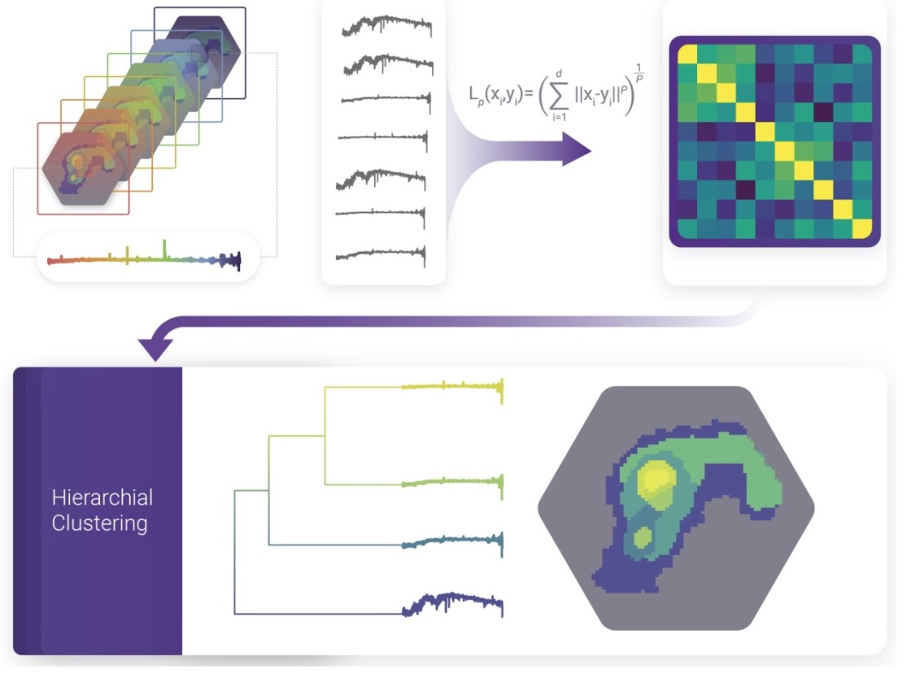
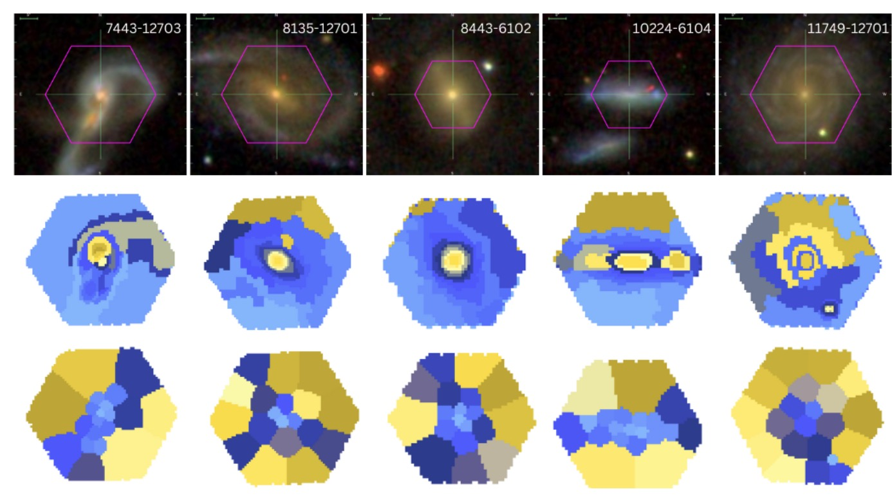

##### Abstract

We present <strong>capivara</strong>, a fast and scalable spectral-based segmentation package designed to study astrophysical properties within distinct structural components of galaxies. This  spectro-segmentation code for integral field unit (IFU) data provides a holistic view of galactic structure, moving beyond conventional radial gradients and the bulge-plus-disk dichotomy. 
It enables detailed comparisons of stellar ages and metallicities across components, and naturally identifies outliers by grouping spaxels according to dominant spectral features. 

The algorithm leverages Torch's scalability and GPU acceleration, outputting a masked FITS file that assigns each pixel to its respective group and generates the corresponding one-dimensional spectrum per group, without relying on Voronoi binning. We demonstrate the capabilities of the method using a sample of MaNGA galaxies, combining capivara segmentation with the starlight spectral fitting code to derive stellar population and ionized gas properties. 

The method effectively identifies regions with similar spectral properties across both continuum and emission lines.  By aggregating the spectra of these regions, we enhance the signal-to-noise ratio of the analysis while preserving the spectral coherence within each group.

---

##### Figure 1: Workflow



##### Figure 2: Galaxy imaging, Capivara, voronoi binning.



---

##### Citation

S de Souza, R., Dahmer-Hahn, L. G., Shen, S., Chies-Santos, A. L., Chen, M., Rahna, P. T., ... & Tahmasebzadeh, B. (2025). capivara: a spectral-based segmentation method for IFU data cubes. Monthly Notices of the Royal Astronomical Society, 539(4), 3166-3179.

```BibTeX
@article{s2025capivara,
  title={capivara: a spectral-based segmentation method for IFU data cubes},
  author={S de Souza, Rafael and Dahmer-Hahn, Luis G and Shen, Shiyin and Chies-Santos, Ana L and Chen, Mi and Rahna, PT and Coelho, Paula and Riffel, Rog{\'e}rio and Ye, Renhao and Tahmasebzadeh, Behzad},
  journal={Monthly Notices of the Royal Astronomical Society},
  volume={539},
  number={4},
  pages={3166--3179},
  year={2025},
  publisher={Oxford University Press}
}
```

---

##### Download

+ [DOI](https://doi.org/10.1093/mnras/staf688)  [Arxiv](https://arxiv.org/abs/2410.21962)
+ [GitHub](https://github.com/RafaelSdeSouza/capivara)

---

##### Related material

+ [Presentation slides short (EN)](AI_UFRGS_2025.pdf)
+ + [Presentation slides (EN)](capivara.pdf)