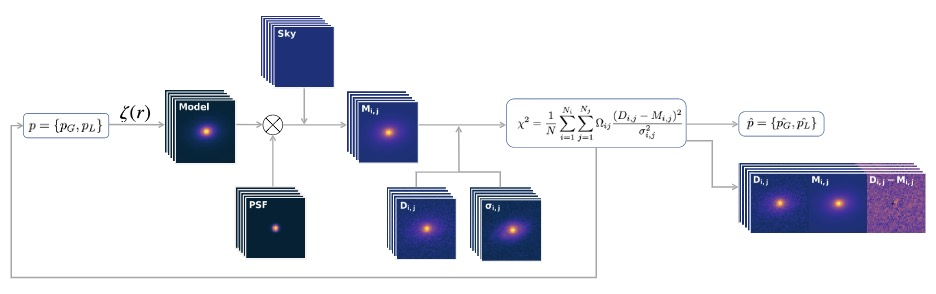
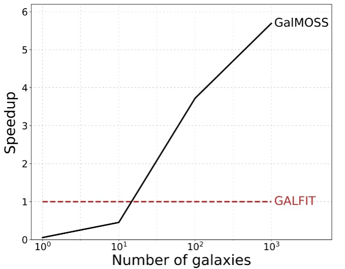

##### Abstract

We introduce galmoss, a python-based, torch-powered tool for two-dimensional fitting of galaxy profiles. By seamlessly enabling GPU parallelization, galmoss meets the high computational demands of large-scale galaxy surveys, placing galaxy profile fitting in the LSST-era. It incorporates widely used profiles such as the Sérsic, Exponential disk, Ferrer, King, Gaussian, and Moffat profiles, and allows for the easy integration of more complex models. Tested on 8,289 galaxies from the Sloan Digital Sky Survey (SDSS) g-band with a single NVIDIA A100 GPU, galmoss completed classical Sérsic profile fitting in about 10 minutes. Benchmark tests show that \galmoss achieves computational speeds that are 6 $\times$ faster than those of default implementations.

---

##### Figure 1: Workflow



##### Figure 2: Speed comparison with GALFIT


---

##### Citation

Chen, M., de Souza, R. S., Xu, Q., Shen, S., Chies-Santos, A. L., Ye, R., ... & Cong, Y. (2024). Galmoss: A package for GPU-accelerated galaxy profile fitting. Astronomy and Computing, 47, 100825.

```BibTeX
@article{chen2024galmoss,
  title={Galmoss: A package for GPU-accelerated galaxy profile fitting},
  author={Chen, Mi and de Souza, Rafael S and Xu, Quanfeng and Shen, Shiyin and Chies-Santos, Ana L and Ye, Renhao and Canossa-Gosteinski, Marco A and Cong, Yanping},
  journal={Astronomy and Computing},
  volume={47},
  pages={100825},
  year={2024},
  publisher={Elsevier}
}
```

---

##### Download

+ [DOI](https://doi.org/10.1016/j.ascom.2024.100825)  [Arxiv](https://arxiv.org/abs/2404.07780)
+ [Documents](https://galmoss.readthedocs.io/en/latest/#)
+ [GitHub](https://github.com/Chenmi0619/GALMoss/) [PYPI](https://pypi.org/project/galmoss/) [Zenodo]( https://zenodo.org/records/10996455)

---

##### Related material

+ [Presentation slides (master defence, EN)](galmoss_MasterDefence_24.05.13.pdf)
+ [Presentation slides (CN)](galmoss_chinesePRE_24.05.07.pdf)
+ [Presentation slides (SHORT, EN)](galmoss_short_23.09.25.pdf)
+ [Poster (EN)](post230925.pdf)