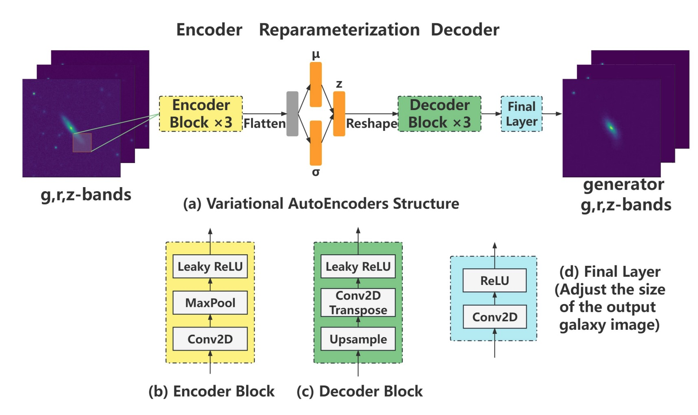
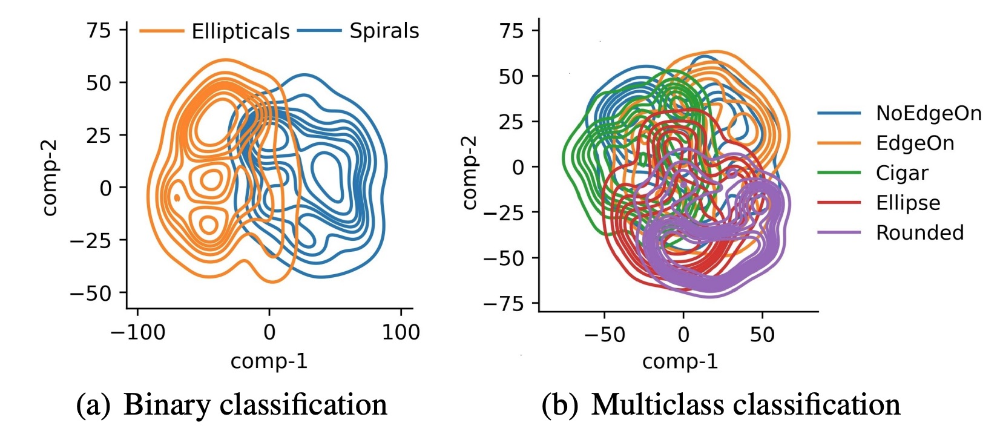

##### Abstract

We present a novel approach for the dimensionality reduction of galaxy images by leveraging a combination of variational
auto-encoders (VAE) and domain adaptation (DA). We demonstrate the effectiveness of this approach using a sample of low
redshift galaxies with detailed morphological type labels from the Galaxy-Zoo DECaLS project. We show that 40-dimensional
latent variables can effectively reproduce most morphological features in galaxy images. To further validate the effectiveness
of our approach, we utilised a classical random forest (RF) classifier on the 40-dimensional latent variables to make detailed
morphology feature classifications. This approach performs similarly to a direct neural network application on galaxy images.
We further enhance our model by tuning the VAE network via DA using galaxies in the overlapping footprint of DECaLS and
BASS+MzLS, enabling the unbiased application of our model to galaxy images in both surveys. We observed that DA led to
even better morphological feature extraction and classification performance. Overall, this combination of VAE and DA can be
applied to achieve image dimensionality reduction, defect image identification, and morphology classification in large optical
surveys.

---

##### Figure 1: Workflow



##### Figure 2: The T-sne of the latent-variance.


---

##### Citation

Xu, Q., Shen, S., de Souza, R. S., Chen, M., Ye, R., She, Y., ... & Durgesh, R. (2023). From images to features: unbiased morphology classification via variational auto-encoders and domain adaptation. Monthly Notices of the Royal Astronomical Society, 526(4), 6391-6400.

```BibTeX
@article{xu2023images,
  title={From images to features: unbiased morphology classification via variational auto-encoders and domain adaptation},
  author={Xu, Quanfeng and Shen, Shiyin and de Souza, Rafael S and Chen, Mi and Ye, Renhao and She, Yumei and Chen, Zhu and Ishida, Emille EO and Krone-Martins, Alberto and Durgesh, Rupesh},
  journal={Monthly Notices of the Royal Astronomical Society},
  volume={526},
  number={4},
  pages={6391--6400},
  year={2023},
  publisher={Oxford University Press}
}
```

---

##### Download

+ [DOI](https://doi.org/10.1093/mnras/stad3181)  [Arxiv](https://arxiv.org/pdf/2303.08627)
+ [GitHub](https://github.com/xuquanfeng/Galaxy_VAE) 

---
<!-- ##### Related material

+ [Presentation slides (master defence, EN)](galmoss_MasterDefence_24.05.13.pdf)
+ [Presentation slides (CN)](galmoss_chinesePRE_24.05.07.pdf)
+ [Presentation slides (SHORT, EN)](galmoss_short_23.09.25.pdf)
+ [Poster (EN)](post230925.pdf) -->